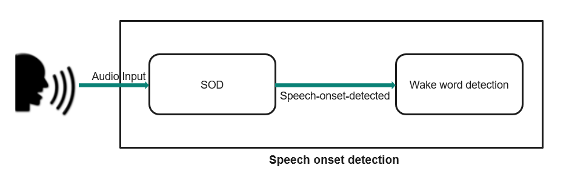

# Audio speech onset detection library

The purpose of a speech onset detector (SOD) is to detect the beginning of a spoken word or utterance. For the target application, the SOD is the first stage of a low power multi-stage wake-up phrase solution. The device is placed in a very low power stand-by mode, but may be woken by the utterance of wake-up phrase. Because the utterance may be spoken at any time, the system is considered "Always On" and may consume significant power. To reduce the power, a multi-stage approach is utilized. In the 1st stage, an always-on low-power SOD is used to detect the onset of speech. If detected, further processing is brought to active state to execute the wake-up phrase detection (WUPD) algorithm. If the WUPD rejects the activity, the WUPD and the processor are placed back in hibernation, and control is passed back to the SOD.



As shown in the block diagram, audio data from the user or environmental noise is fed to the SOD algorithm and the algorithm processes audio data and checks if speech onset is detected. If speech onset is detected, then the audio data is fed to the wake word detection algorithm for further processing.

Speech onset detection middleware provides APIs to feed the audio data and get the status on whether the speech onset was detected or not.

## Features and Functionality

- **SOD MW Input format:**
  - SOD MW accepts audio data in PCM format at 16Khz, worth of 10ms for every `cy_sod_feed()`.

- **SOD MW configurable options:**
  - OnsetGap
  - Sensitivity

  - **OnsetGap:**
    - Generally, a talker will pause momentarily before addressing a person or device. The pause is approximately in the range of 200-500 ms in conversational speech. This compares with the time between words in conversational speech of 0-100ms. If the application is attempting to detect a wake-word, then a pause of at least 200ms is likely. Detecting a keyword in conversational speech would require essentially no pause at all; therefore, it needs full-time monitoring and is thus unlikely to use an SOD. For the wake-word detection application, having a pause has the advantage of disengaging the wake-word detection during conversational speech and relying on the low complexity SOD to detect an appropriate pause.

  - **Sensitivity:**
    - The performance of the SOD can be characterized by its detection rate and false positive rate. Their relationship is captured in the receiver operating characteristic curve (ROC) and studied. As the SNR decreases (increasing noise relative to the speech signal), the false positive rate increases for a given detection rate. In order to control the operating point of the SOD, and hence the trade-off between detection rate and false positive rate, sensitivity is defined. The sensitivity is controlled by modifying the thresholds for detection.


## Quick Start

To use the speech onset detection library, update your application's Makefile as follows:

1. **Add required components to your application's Makefile:**
   ```makefile
   # Add required middleware and OS features
   COMPONENTS+=FREERTOS RTOS_AWARE
   ```
   *If these macros are not present, define them in your project Makefile.*

2. **Enable the speech onset detection library:**
   ```makefile
   # Enable SOD library as a standalone component
   DEFINES+=ENABLE_IFX_SOD
   ```
   *Add this macro to your Makefile.*

3. **Define the AVC (Audio Voice Core) component in your application's Makefile. Choose one of the following options:**
   ```makefile
   # For demo configuration
   COMPONENTS+=AVC_DEMO
   # or for full configuration (production use)
   COMPONENTS+=AVC_FULL
   ```

4. **(Optional) Enable debug log messages:**
   ```makefile
   # Enable SOD debug log messages for development and troubleshooting
   DEFINES+=ENABLE_SOD_LOGS
   ```
   *Note: Debug logging may impact performance and is recommended only for development.*

5. **Initialize logging in your application code:**
   ```c
   // Initialize logging (from cy-log module, part of connectivity-utilities library)
   cy_log_init();
   ```
   *See the [connectivity-utilities library API documentation](https://Infineon.github.io/connectivity-utilities/api_reference_manual/html/group__logging__utils.html) for details.*


## Supported Platforms

- PSoC&trade; Edge E84 MCU

## Supported Toolchains

| Toolchain     | Version                                  |
| :---          | :----:                                   |
| Arm Compiler  | Arm&reg; Embedded Compiler 6.22          |
| LLVM Compiler | LLVM&reg; Embedded Compiler 19.1.5       |

## Header Files

Applications using the speech onset detection library must include only the `cy_sod.h` file (typically found in the middleware include directory).

## Additional Information

- [Speech onset detection RELEASE.md](./RELEASE.md)
- [Connectivity utilities API documentation (cy-log)](https://Infineon.github.io/connectivity-utilities/api_reference_manual/html/group__logging__utils.html)
- [ModusToolbox&trade; software environment, quick start guide, documentation, and videos](https://www.infineon.com/cms/en/design-support/tools/sdk/modustoolbox-software/)
- [Speech onset detection version.xml](./version.xml)